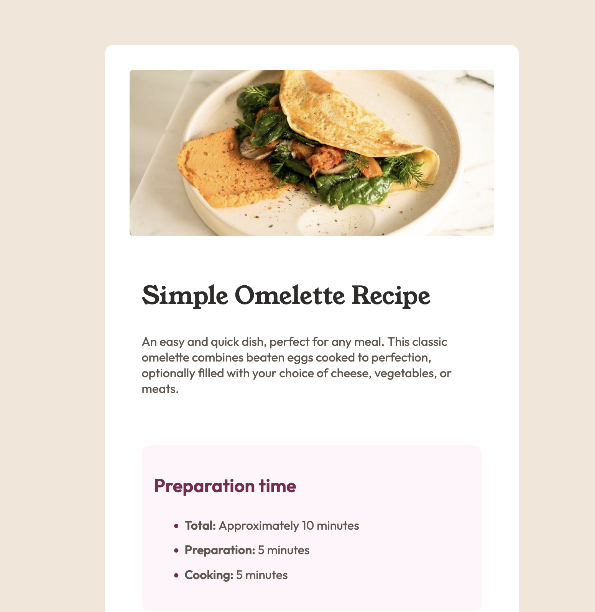
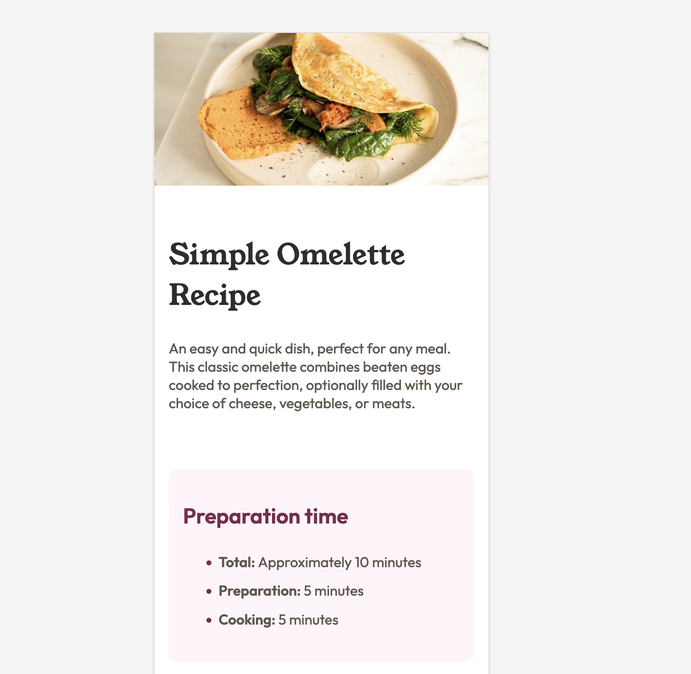

# Frontend Mentor - Recipe page solution

This is a solution to the [Recipe page challenge on Frontend Mentor](https://www.frontendmentor.io/challenges/recipe-page-KiTsR8QQKm). Frontend Mentor challenges help you improve your coding skills by building realistic projects. 

## Table of contents

- [Overview](#overview)
  - [The challenge](#the-challenge)
  - [Screenshot](#screenshot)
  - [Links](#links)
- [Author](#author)

## Overview

### Screenshot

Desktop view

Mobile view

### Links

- Solution URL: [Github](https://github.com/cvtqx/recipe-page-design)
- Live Site URL: [Github Pages](https://cvtqx.github.io/recipe-page-design/)

## Author

- Website - [My portfolio](https://www.olgayudkin.com)
- Frontend Mentor - [@cvtqx](https://www.frontendmentor.io/profile/cvtqx)

